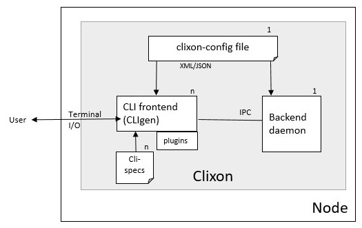

.. _clixon_cli:
.. sectnum::
   :start: 9
   :depth: 3

***
CLI
***

Overview
========

The Clixon CLI provides an interactive command-line interface
to a user. Each usage instantiates a new process which communicates
via NETCONF with the backend daemon over an IPC socket.

The Clixon CLI uses `CLIgen <https://www.cligen.se>`__, an interactive
interpreter of commands. Syntax is given as *cli-specifications* which
specify callbacks defined in plugins.

For details on CLIgen syntax and behavior, please consult the `CLIgen tutorial <https://github.com/clicon/cligen/blob/master/cligen_tutorial.pdf>`_.

Clixon comes with a generated CLI, the `autocli`_, where all
configuration-related syntax is generated from YANG. 

You can also create a completely manually-made CLI.

The CLI depends on the following:

* *Clixon-config*: The Clixon config-file contains initial CLI configuration, such as where to find cli-specs, plugins and autocli configuration.
* *Cli-specs*: CLI specification files written in `CLIgen <https://github.com/clicon/cligen/blob/master/cligen_tutorial.pdf>`_ syntax.
* *Plugins*: Dynamic loadable plugin files loaded at startup. Callbacks from cli-spec files are resolved and need to exist as symbols either in the Clixon libs or in the plugin file.

The following example from the `main example <https://github.com/clicon/clixon/tree/master/example/main>`_. First, a cli-spec file containing two commands::

  set("Set configuration symbol") @datamodel, cli_auto_set();
  show("Show a particular state of the system") configuration("Show configuration"), cli_show_config("candidate", "text", "/");
  example("Callback example") <var:int32>("any number"), mycallback("myarg");

In the CLI, these generate CLI commands such as::

   set interfaces interface eth9
   show config
   example 23

The effect of typing the commands above is calling callbacks, either
library functions in Clixon libs(``cli_show_config()``), or
application-defined in a plugin(``mycallback()``)

In this way, a designer writes cli command specifications which
invokes C-callbacks. If there are no appropriate callbacks the
designer must write a new callback function.
   
Example usage
-------------
The following example shows an auto-cli session from the `main example <https://github.com/clicon/clixon/tree/master/example/main>`_ how to add an interface in candidate, validate and commit it to running, then look at it as xml and cli and finally delete it::

   clixon_cli -f /usr/local/etc/example.xml 
   user@host> set interfaces interface eth9 ?
     description               enabled                   ipv4                     
     ipv6                      link-up-down-trap-enable  type                     
   user@host> set interfaces interface eth9 type ex:eth
   user@host> validate 
   user@host> commit 
   user@host> show configuration xml 
   <interfaces xmlns="urn:ietf:params:xml:ns:yang:ietf-interfaces">
     <interface>
       <name>eth9</name>
       <type>ex:eth</type>
       <enabled>true</enabled>
     </interface>
   </interfaces>
   user@host> show configuration cli
   set interfaces interface eth9 
   set interfaces interface eth9 type ex:eth
   set interfaces interface eth9 enabled true
   user@host> delete interfaces interface eth9

Command-line options
--------------------
The `clixon_cli` client has the following command-line options:
  -h              Help
  -D <level>      Debug level
  -f <file>       Clixon config file
  -E <dir>        Extra configuration directory
  -F <file>       Read commands from file (default stdin)
  -1              Run once, do not enter interactive mode
  -a <family>     Internal IPC backend socket family: UNIX|IPv4|IPv6
  -u <path|addr>  Internal IPC socket domain path or IP addr (see -a)
  -d <dir>        Specify cli plugin directory
  -m <mode>       Specify plugin syntax mode
  -q              Quiet mode, do not print greetings or prompt, terminate on ctrl-C
  -p <dir>        Add Yang directory path (see CLICON_YANG_DIR)
  -G              Print auo-cli CLI syntax generated from YANG
  -L              Debug print dynamic CLI syntax including completions and expansions
  -l <option>     Log on (s)yslog, std(e)rr, std(o)ut, (n)one or (f)ile. Stderr is default. 
  -y <file>       Load yang spec file (override yang main modul)e
  -c <file>       Specify cli spec file
  -U <user>       Over-ride unix user with a pseudo user for NACM.
  -o <option=value>  Give configuration option overriding config file (see clixon-config.yang)

Configure options
=================
The following config options are related to clispec and plugin files (clixon config options), ie they are set in the XML Clixon config file:

CLICON_CLI_DIR
  Directory containing frontend cli loadable plugins. Load all `.so` plugins in this directory as CLI object plugins.

CLICON_CLISPEC_DIR
  Directory containing frontend cligen spec files. Load all `.cli` files in this directory as CLI specification files.

CLICON_CLISPEC_FILE
  Specific frontend cligen spec file as alternative or complement to `CLICON_CLISPEC_DIR`. Also available as `-c` in clixon_cli.

Terminal I/O
------------
Clixon CLI have the following configuration options related to terminal I/O:

CLICON_CLI_LINESCROLLING
  Set to `0` if you want CLI to wrap to next line.
  Set to `1` if you want CLI to scroll sideways when approaching right margin (default).

CLICON_CLI_LINES_DEFAULT
Set to number of CLI terminal rows for pagination/scrolling. `0` means unlimited.  The number is set statically UNLESS:

   * there is no terminal, such as file input, in which case nr lines is `0`
   * there is a terminal sufficiently powerful to read the number of lines from ioctl calls.

In other words, this setting is used ONLY on raw terminals such as serial consoles.

CLICON_CLI_TAB_MODE
   Set CLI tab mode. See detailed info in YANG source

History
-------
Clixon CLI supports persistent command history. There are two CLI history related configuration options:

CLICON_CLI_HIST_FILE
  The file containing the history, default value is: `~/.clixon_cli_history`

CLICON_CLI_HIST_SIZE
  Max number of history line, default value is 300.

The design is similar to bash history but is simpler in some respects:
   - The CLI loads/saves its complete history to a file on entry and exit, respectively
   - The size (number of lines) of the file is the same as the history in memory
   - Only the latest session dumping its history will survive (bash merges multiple session history).

Further, tilde-expansion is supported and if history files are not found or lack appropriate access will not cause an exit but are logged at debug level

Help strings
------------
Help strings are specified using the following example syntax: ``("help string")``. help strings are shown at queries, eg "?"::

    user@host> show <?>
       all       Show all
       routing   Show routing
       files     Show files

For long or multi-line help strings the following configure options exists:

CLICON_CLI_HELPSTRING_TRUNCATE
  Set to 0 to wrap long help strings to the next line. (default)
  Set to 1 to truncate long help strings at the right margin

CLICON_CLI_HELPSTRING_LINES
  Set to 0 to have no limit on the number of help string lines per command
  Set to <n> to limit the the number of help string lines

Long and multi-line help strings may especially be needed in the auto-cli, see `autocli`_.

Modes
-----
The CLI can have different *modes* which is controlled by a config option and some internal clispec variables. The config options are:

CLICON_CLI_MODE
  Startup CLI mode. This should match a ``CLICON_MODE`` variable setting in one of the clispec files. Default is "base".
CLICON_CLI_VARONLY
  Do not include keys in cvec in cli vars callbacks

Inside the clispec files ``CLICON_MODE`` is used to specify to which modes the syntax in a specific file defines. For example, if you have major modes `configure` and `operation` you can have a file with commands for only that mode, or files with commands in both, (or in all).

First, lets add a single command in the configure mode::
   
  CLICON_MODE="configure";
  show configure;

Then add syntax to both modes::

  CLICON_MODE="operation:configure";
  show("Show") files("Show files");

Finally, add a command to all modes::

  CLICON_MODE="*";
  show("Show") all("Show all");
   
Note that CLI command trees are merged so that show commands in other files are shown together. Thus, for example, using the clispecs above the two modes are the three commands in total for the *configure* mode::

  > clixon_cli -m configure
  user@host> show <TAB>
    all     routing      files

but only two commands  in the *operation* mode::

  > clixon_cli -m operation 
  user@host> show <TAB>
    all      files

Cli-spec variables
------------------
A CLI specification file (note not clixon config file) typically starts with the following variables:

CLICON_MODE
  A colon-separated list of CLIgen `modes`. The CLI spec in the file are added to *all* modes specified in the list. You can also use wildcards ``*`` and '`?``.

CLICON_PROMPT
  A string describing the CLI prompt using a very simple format with: ``%H`` (host) , ``%U`` (user) , ``%T`` (tty),  ``%W`` (last element of working path), ``%w`` (full working path).

CLICON_PLUGIN
  The name of the object file containing callbacks in this file.

CLI callbacks
=============
CLI callback functions are "library" functions that an application may call from a clispec. A
user is expected to create new application-specific callbacks.

As an example, consider the following clispec::

   example("Callback example") <var:int32>("any number"), mycallback("myarg");
 
containing a keyword (`example`) and a variable (`var`) and `mycallback` is a cli callback with argument: (`myarg`).

In C, the callback has the following signature::

  int mycallback(clicon_handle h, cvec *cvv, cvec *argv);

Suppose a user enters the following command in the CLI::

  user@host> example 23

The callback is called with the following parameters::

  cvv: 
     0: example 23
     1: 23
  argv:
     0: "myarg"

which means that `cvv` contains dynamic values set by the user, and `argv` contains static values set by the clispec designer.

Autocli
=======
The Clixon CLI contains parts that are *generated* from a YANG
specification. This *autocli* is generated from YANG into CLI specifications, 
parsed and merged into the top-level Clixon CLI.

The autocli is configured using three basic mechanisms:

1. `Config file`_ : Modify behavior of the generated tree
2. `Tree expansion`_: How the generated cli is merged into the overall CLI
3. `YANG Extensions`_: Modify CLI behavior via YANG

Each mechanism is described in sub-sections below, but first an overview of autocli usage.   

Overview
--------
Consider a (simplified) YANG specification, such as::

  module example {
    container table {
      list parameter{
        key name;
        leaf name{
          type string;
        }
      }
    }
  }

An example of a generated syntax is as follows (again simplified)::

   table; {
      parameter <name:string>;
   }

The auto-cli syntax is loaded using a `sub-tree operator`_ such as ``@datamodel`` into the Clixon CLI as follows::

  CLICON_PROMPT="%U@%H %W> ";
  set @datamodel, cli_auto_set();
  merge @datamodel, cli_auto_merge();
  delete @datamodel, cli_auto_del();
  show config, cli_auto_show("datamodel", "candidate", "text", true, false);{
     @datamodel, cli_show_auto("candidate", "text");
  }

For example, the `set` part is expanded using the CLIgen tree-operator to something like::

  set table, cli_auto_set(); {
        parameter <name:string>, cli_auto_set();
  }
  
An example run of the above example is as follows::

  > clixon_cli
  user@host /> set table ?
    <cr>
    parameter         
  user@host /> set table parameter 23
  user@host /> show config
  table {
     parameter {
        name 23;
     }
  }
  user@host />

where the generated autocli extends the Clixon CLI with YANG-derived configuration statements.

Config file
-----------
The clixon config file has a ``<autocli>`` sub-clause for global
autocli configurations.  A typical CLI configuration
with default autocli settings is as follows::

  <clixon-config xmlns="http://clicon.org/config">
    <CLICON_CONFIGFILE>/usr/local/etc/example.xml</CLICON_CONFIGFILE>
    ...
    <autocli>
      <module-default>true</module-default>
      <list-keyword-default>kw-nokey</list-keyword-default>
      <treeref-state-default>false</treeref-state-default>
      <edit-mode-default>list container</edit-mode-default>
      <completion-default>true</completion-default>
    </autocli>
  </clixon-config>

The autocli configuration consists of a set of default *options*, followed by a set of *rules*. For more info see the ``clixon-autocli.yang`` specification.

Options
^^^^^^^
The following options set default values to the auto-cli, some of these may be further refined by successive rules.

`module-default`
   How to generate the autocli from modules:

   - If `true`, all modules with a top-level datanode are generated, ie they get a top-level entry in the ``@basemodel`` tree. This is default
   - If `false`, you need to explicitly enable modules for autocli generation  using `module enable rules`_.

`list-keyword-default`
   How to generate the autocli from YANG lists. 
   There are several variants defined. To understand the different variants, consider a simple YANG LIST defintion as follows::

      list a {
         key x;
	 leaf x;
	 leaf y;
      }

   The different variants with the resulting autocli are as follows:
   
   - `kw-none` : No extra keywords, only variables: ``a <x> <y>``
   - `kw-nokey` : Keywords on non-key variables: ``a <x> y <y>``. This is default.
   - `kw-all` : Keywords on all variables: ``a x <x> y <y>``

`treeref-state-default`
   If generate autocli from YANG *state* data. The motivation for this option is that many specs have very large state parts. In particular, some openconfig YANG specifications have  ca 10 times larger state than config parts.

   - If `true`, generate CLI from YANG state/non-config statements, not only from config data. 
   - If `false` do not generate autocli commands from YANG state data. This is default.

`edit-mode-default`
   Open automatic edit-modes for some YANG keywords and do not allow others.
   A CLI edit mode opens a carriage-return option and changes the context to be 
   in that local context.
   For example::

      user@host> interfaces interface e0<cr>
      eth0> 

   Default is to generate edit-modes for all YANG containers and lists. For more info see `edit modes`_
   
`completion-default`
   Generate code for CLI completion of existing db symbols. 
   That is, check existing configure database for completion options.
   This is normally always enabled.
   
Rules
^^^^^
To complement options, a set of rules to further define the autocli can be defined. 
Common rule fields are:

`name`
   Arbitrary name assigned for the rule, must be unique.

`operation`
   Rule operation, There are currently two operations defined: `module enable` and command `compress`.

`module-name`
   Name of the module associated with this rule.
   Wildchars '*' and '?' can be used (glob pattern).
   Revision and yang suffix are omitted.
   Example: ``openconfig-*``

Module enable rules
^^^^^^^^^^^^^^^^^^^
Module enable rules are used in combination with
``module-default=false`` to enable CLI generation for a limited set of
YANG modules.

For example, assume you want to enable modules `example1`, `example2` and no others::

   <autocli>
      <module-default>false</module-default>
      <rule>
         <name>include example</name>
         <operation>enable</operation>
         <module-name>example*</module-name>
     </rule>
   </autocli>

If the option ``module-default`` is ``true``, module enable rules have no effect since all modules are already enabled.
   
Compress rules
^^^^^^^^^^^^^^
Compress rules are used to skip CLI commands, making the complete command name shorter.

For example, assume YANG definition::

   container interfaces {
      list interface {
         ...
      }
   }
   
Instead of typing ``interfaces interface e0`` you would want to type only ``interface e0``.
The following rule matches all YANG containers with lists as its only child, and removes the keyword ``interfaces``::

   <rule>
      <name>compress</name>
      <operation>compress</operation>
      <yang-keyword>container</yang-keyword>
      <yang-keyword-child>list</yang-keyword-child>
   </rule>  

Note that this matches the openconfig compress rule: `The surrounding 'container' entities are removed from 'list' nodes <https://github.com/openconfig/ygot/blob/master/docs/design.md#openconfig-path-compression>`_

A second openconfig compress rule is `The 'config' and 'state' containers are "compressed" out of the schema. <https://github.com/openconfig/ygot/blob/master/docs/design.md#openconfig-path-compression>`_ as examplified here (for 'config' only)::

   <rule>
      <name>openconfig compress</name>
      <operation>compress</operation>
      <yang-keyword>container</yang-keyword>
      <schema-nodeid>config</schema-nodeid>
      <module-name>openconfig*</module-name>
   </rule>
   
Specific fields for compress are:

`yang-keyword`
   If present identifes a YANG keyword which the rule applies to.
   Example: ``container``

`schema-nodeid`
   A single <id> identifying a YANG schema-node identifier as defined in RFC 7950 Sec 6.5.
   Example: ``config``

`yang-keyword-child`
   The YANG statement has a single child, and the yang type of the child is the value of this option.
   Example: : ``container``

`extension`
   The extension is set either in the node itself, or in the module the node belongs to.
   Extension prefix must be set.
   Example: ``oc-ext:openconfig-version``

Tree expansion
--------------
In the example above, the tree-reference ``@datamodel`` is used to
merge the YANG-generated cli-spec into the overall cli-spec. There are
several variants of how the generated tree is expanded with slight differences in which
symbols are shown, how completion works, etc.

They are all derivates of the basic ``@basemodel`` tree.  The following tree variants are
defined:

* ``@basemodel`` - The most basic tree including everything
* ``@datamodel`` - The most common tree for configuration with state
* ``@datamodelshow`` - A tree made for showing configuration syntax
* ``@datamodelmode`` - A tree for editing modes
* ``@datamodelstate`` - A tree for showing state as well as configuration

Note to use ``@datamodelstate`` config option ``treeref-state-default`` must be set.
  
  
YANG Extensions
---------------
A third method to define the autocli is using :ref:`YANG
extensions<clixon_yang>`, where a YANG specification is annotated with extension.

Clixon provides a dedicated YANG extension for the autocli for this purpose: ``clixon-lib:autocli``.

The following example shows the main example usage of the "hide" extension of the "hidden" leaf::

   import clixon-autocli{
      prefix autocli;
   }
   container table{
      list parameter{
         ...
         leaf hidden{
            type string;
            autocli:hide;
         }
      }
   }

The CLI ``hidden`` command is not shown but the command still exists::

  cli /> set table parameter a ?
  value
  <cr>
  cli /> set table parameter a hidden 99
  cli /> show configuration 
  table {
    parameter {
        name a;
        hidden 99;
    }
  }
   
The following autocli extensions are defined:

``hide``
   Do not show the command in eg auto-completion. This was primarily intended for operational commands such as ``start shell`` but is this context used for hiding commands generated from the associated YANG node. 
``hide-show``
   Do not show the config in show configuration commands. However, retreiving a config via NETCONF or examining the datastore directly shows the hidden configure commands.
``strict-expand``
   Only show exactly the expanded options of a variable. It shuld not be possible to add a *new* value that is not in the expanded list.

Edit modes
----------
The autocli supports *automatic edit modes* where by entering a ``<cr>``, you enter an edit mode. An edit mode is created for every YANG container or list.

For example, the example YANG previously given and the following cli-spec::

   edit @datamodelmode, cli_auto_edit("basemodel");
   up, cli_auto_up("basemodel");
   top, cli_auto_top("basemodel");
   set @datamodel, cli_auto_set();

Then an example session for illustration is as follows, where first a small config is created, then a list instance mode is entered(``parameter a``), a value changed, and a container mode (``table``)::

  user@host /> set table parameter a value 42
  user@host /> set table parameter b value 77
  user@host /> edit table parameter a
  user@host parameter=a/> 
  user@host parameter=a/> show configuration
    name a;
    value 42;
  user@host parameter=a/> set value 99
  user@host parameter=a/> up
  user@host table> show configuration 
  parameter {
      name a;
      value 99;
  }
  parameter {
      name b;
      value 77;
  }
  user@host table> top
  user@host /> 
   
Upgrade from pre Clixon 5.5
---------------------------
The new autocli configuration described here was introduced in Clixon
5.5. In previous versions, the autocli was configured using
regular config options.

Note, tree references are backward compatible and need not be modified.

Config file upgrade
^^^^^^^^^^^^^^^^^^^
Instructions to upgrade from pre-5.5 to the new configuration model:

CLICON_CLI_GENMODEL
    A ``false`` value is translated to ``<autocli><module-default>false<...>``.
    A ``true`` value is implicit.

CLICON_CLI_MODEL_TREENAME
    This optoin is removed, but you can set compile-time constant ``AUTOCLI_TREENAME`` instead

CLICON_CLI_AUTOCLI_EXCLUDE
    This option needs to be rewritten using a combination of ``module-default=false`` and `module enable rules`_.

CLICON_CLI_GENMODEL_TYPE
    The "genmodel-type" settings are mainly translated to ``<autocli><list-keyword-default>x</list-keyword-default></autocli>`` where ``x`` is one of the following:

    - ``NONE`` is translated to ``kw-none``
    - ``VARS`` is translated to ``kw-nokey``
    - ``ALL`` is translated to ``kw-all``
    - ``HIDE``, ``OC_COMPRESS``  is translated to ``kw-nokey`` as well as described in `compress rules`_.

CLICON_CLI_GENMODEL_COMPLETION
    Use ``<autocli><completion-default>x<...>`` instead, where ``x`` is true or false.

Extensions
^^^^^^^^^^
The hide extensions from `clixon-lib` are moved to new extensions in `clixon-autocli` as follows:

hide
  Use ``hide`` in autocli instead. 
hide-database
  Use ``hide-show`` in autocli instead.
hide-database-auto-completion
  Use both ``hide`` and ``hide-show`` in autocli instead.

Advanced
========
This section describes some advanced options in the Clixon CLI not described elsewhere.

Backend socket
--------------

By default, the CLI uses a UNIX socket as an IPC to communicate with
the backend.  It is possible to use an IP socket but with a restricted functionality, see :ref:`backend section<clixon_backend>`.

Start session
^^^^^^^^^^^^^

The session creation is "lazy" in the sense that a NETCONF session is
only established when needed. After the session has been
established, it is maintained (cached) by the CLI client to keep track
of candidate edits and locks, as described in 7.5 of `RFC 6241 <https://www.rfc-editor.org/rfc/rfc6241.html/>`_.

If there is no backend running at the time of session establishment, a warning is printed::
  
  cli /> show config
  Mar 18 11:53:43: clicon_rpc_connect_unix: 541: Protocol error: /usr/local/var/example/example.sock: config daemon not running?: No such file or directory
  Protocol error: /usr/local/var/example/example.sock: config daemon not running?: No such file or directory
  cli /> 

If at a later time, the backend is started, the session is established normally

Close session
^^^^^^^^^^^^^
After a session is established and the *backend* exits, crashes or restarts, any
state associated with the session will be lost, including:

* explicit locks
* edits in candidate-db
  
If the backend exits during an existing session, it will close with the same error message as above::

  cli /> show config
  Mar 18 11:53:43: clicon_rpc_connect_unix: 541: Protocol error: /usr/local/var/example/example.sock: config daemon not running?: No such file or directory
  Protocol error: /usr/local/var/example/example.sock: config daemon not running?: No such file or directory
  cli /> 

If the backend restarts, a new session is created with a warning::

  cli /> show configuration
  Mar 18 11:57:55: The backend was probably restarted and the client has reconnected to the backend. Any locks or candidate edits are lost.
  cli />

Alternative
^^^^^^^^^^^
It is possible to change the default behavior by undefining the compile-option: `#undef PROTO_RESTART_RECONNECT`. If so, the CLI is exited when the existing session is closed in anyway::

  cli /> show configuration
  Mar 18 12:02:57: clicon_rpc_msg: 210: Protocol error: Unexpected close of CLICON_SOCK. Clixon backend daemon may have crashed.: Cannot send after transport endpoint shutdown
  Protocol error: Unexpected close of CLICON_SOCK. Clixon backend daemon may have crashed.: Cannot send after transport endpoint shutdown
  bash# 
  
Sub-tree operator
-----------------
Sub-trees are defined using the tree operator `@`. Every mode gets assigned a tree which can be referenced as `@name`. This tree can be either on the top-level or as a sub-tree. For example, create a specific sub-tree that is used as sub-trees in other modes::
   
  CLICON_MODE="subtree";
  subcommand{
    a, a();
    b, b();
  }

then access that subtree from other modes::
   
  CLICON_MODE="configure";
  main @subtree;
  other @subtree,c();

The configure mode will now use the same subtree in two different commands. Additionally, in the `other` command, the callbacks are overwritten by `c`. That is, if `other a`, or `other b` is called, callback function `c` is invoked.

Translators
-----------
CLIgen supports wrapper functions that can take the output of a
callback and transform it to something else.

The CLI can perform variable translation. This is useful if you want to
process the input, such as hashing, encrypting or in other way
translate the input.

The following example is based on the main Clixon example and is included in the regression tests. In the following CLI specification, a "translate" command sets a modifed value to the "table/parameter=translate/value"::

  translate <value:string translate:cli_incstr()>, cli_set("/clixon-example:table/parameter=translate/value");

If you run this example using the `cli_incstr()` function which increments the characters in the input, you get this result::

  user@host> translate HAL
  user@host> show configuration
  table {
     parameter {
        name translate;
        value IBM;
     }
  }

The example is very simple and based on strings, but can be used also for other types and more advanced functions.

Autocli tree labels
-------------------
The autocli trees described in `tree expansion`_ are implemented using filtering of CLIgen
labels. While ``@basemodel`` includes all labels, the other trees have
removed some labels.

For most uses, the pre-defined trees above are enough, using explicit label filtering is more powerful.

The currently defined labels are:

* ``act-list``      : Terminal entries of YANG LIST nodes.
* ``act-container`` : Terminal entries of YANG CONTAINER nodes.
* ``ac-leaf``       : Leaf/leaf-list nodes
* ``act-prekey``    : Terminal entries of LIST leaf keys, except the last keys in multi-key cases.
* ``act-lastkey``   : Terminal entries of LIST leaf keys, except the last keys in multi-key cases.
* ``act-leafconst`` : Terminal entries of non-empty non-key YANG LEAF/LEAF_LISTs command nodes.
* ``act-leafvar``   : Terminal entries of non-key YANG LEAF/LEAF_LISTs variable nodes.
* ``ac-state``      : Nodes which have YANG ``config false`` as child
* ``ac-config``     : Nodes nodes which do not have any state nodes as siblings

Labels with prefix ``act_`` are *terminal* labels in the sense that they mark a terminal command, ie the node itself; while labels with ``ac_`` represent the non-terminal, ie the whole sub-tree.

As an example, the ``@datamodel`` tree is ``basemodel`` with labels removed as follows::

   @basemodel, @remove:act-prekey, @remove:act-list, @remove:act-leaf, @remove:ac-state;

which is an alternative way of specifying the datamodel tree.   

Extensions to CLIgen
--------------------
Clixon adds some features and structure to CLIgen which include:

- A plugin framework for both textual CLI specifications(.cli) and object files (.so)
- Object files contains compiled C functions referenced by callbacks in the CLI specification. For example, in the cli spec command: `a,fn()`, `fn` must exist in the object file as a C function.
- The CLIgen `treename` syntax does not work.
- A CLI specification file is enhanced with the CLIgen variables `CLICON_MODE`, `CLICON_PROMPT`, `CLICON_PLUGIN`.
- Clixon generates a command syntax from the Yang specification that can be referenced as `@datamodel`. This is useful if you do not want to hand-craft CLI syntax for configuration syntax.

Example of `@datamodel` syntax:
::
   
  set    @datamodel, cli_set();
  merge  @datamodel, cli_merge();
  create @datamodel, cli_create();
  show   @datamodel, cli_show_auto("running", "xml");		   

The commands (eg `cli_set`) will be called with the first argument an api-path to the referenced object.

Running CLI scripts
-------------------
The CLI can run scripts using either the ``-1`` option for single commands::

  clixon_cli -1 show version
  4.8.0.PRE

Or using the ``-F <file>`` command-line option to redirect input from file

  clixon_cli -F file

Or using "shebang"::

  #!/usr/local/bin/clixon_cli -F
  show version
  quit

How to deal with large specs
----------------------------
CLIgen is designed to handle large specifications in runtime, but it may be
difficult to handle large specifications from a design perspective.

Here are some techniques and hints on how to reduce the complexity of large CLI specs:

Sub-modes
^^^^^^^^^
The `CLICON_MODE` is used to specify in which modes the syntax in a specific file should be added. For example, if you have major modes `configure` and `operation` you can have a file with commands for only that mode, or files with commands in both, (or in all).

First, lets add a basic set in each:
::
   
  CLICON_MODE="configure";
  show configure;

and

::
   
  CLICON_MODE="operation";
  show configure;

Note that CLI command trees are *merged* so that show commands in other files are shown together. Thus, for example:
::

  CLICON_MODE="operation:files";
  show("Show") files("files");

will result in both commands in the operation mode:
::

  > clixon_cli -m operation 
  user@host> show <TAB>
    configure      files

but 
::

  > clixon_cli -m configure
  user@host> show <TAB>
    configure
  
Sub-trees
^^^^^^^^^
You can also use sub-trees and the the tree operator `@`. Every mode gets assigned a tree which can be referenced as `@name`. This tree can be either on the top-level or as a sub-tree. For example, create a specific sub-tree that is used as sub-trees in other modes:
::
   
  CLICON_MODE="subtree";
  subcommand{
    a, a();
    b, b();
  }

then access that subtree from other modes:
::
   
  CLICON_MODE="configure";
  main @subtree;
  other @subtree,c();

The configure mode will now use the same subtree in two different commands. Additionally, in the `other` command, the callbacks will be overwritten by `c`. That is, if `other a`, or `other b` is called, callback function `c` will be invoked.
  
C-preprocessor
^^^^^^^^^^^^^^
You can also add the C preprocessor as a first step. You can then define macros, include files, etc. Here is an example of a Makefile using cpp:
::
   
   C_CPP    = clispec_example1.cpp clispec_example2.cpp
   C_CLI    = $(C_CPP:.cpp=.cli
   CLIS     = $(C_CLI)
   all:     $(CLIS)
   %.cli : %.cpp
        $(CPP) -P -x assembler-with-cpp $(INCLUDES) -o $@ $<

Bits
----
The Yang bits built-in type as defined in RFC 7950 Sec 9.7 provides a set of bit names. In the CLI, the names should be given in a white-spaced delimited list, such as ``"fin syn rst"``.

The RFC defines a "canonical form" where the bits appear ordered by their position in YANG, but Clixon validation accepts them in any order.

Given them in XML and JSON follows thus, eg XML::

   <flags>fin rst syn</flags>

Clixon CLI does not treat individual bits as "first-level objects". Instead it only validates the whole string of bit names. Operations (add/remove) are made atomically on the whole string.
