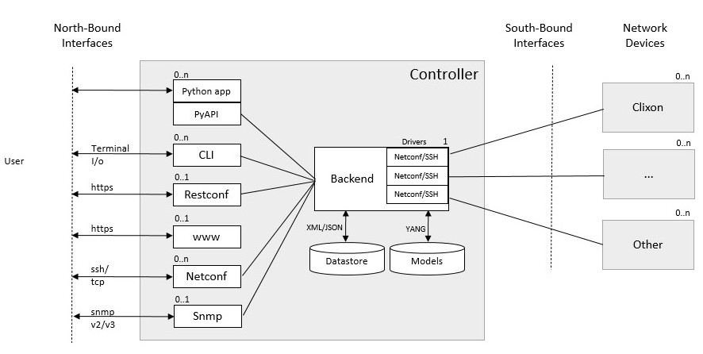
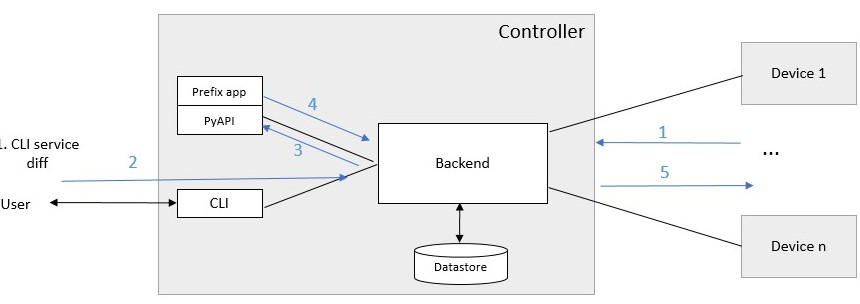

.. _clixon_controller:
.. sectnum::
   :start: 15
   :depth: 3

**********
Controller
**********

.. note::
          The controller is experimental and many features described here are not yet implemented

This section describes the clixon network controller, an extension of
Clixon to manage devices using NETCONF.

The goal of the clixon network controller is to provide a simple
network controller for NETCONF devices (not only Clixon).

Further, the controller has the following aims:

- Network services, with a Python API
- Multiple devices, with different YANG schemas
- Transactions with validate/commit/revert across groups of devices
- RFC 8528 yang schema mount allows multiple yang schemas (per device)
- Scaling up to 100 devices.

Architecture
============

The controller is built using the regular CLIgen/Clixon system, where
the controller semantics is implemented using plugins. The `backend`
is the core of the system controlling the datastores and accessing the
YANG models.

The southbound API is NETCONF over SSH to network devices.

The northbound APIs are YANG-derived Restconf, Autocli, Netconf, and
Snmp.  The controller CLI has two modes: operation and configure, with
an autocli configure mode derived from YANG.

A PyAPI module accesses configuration data via an `actions API`. The
PyAPI module reads services configuration and writes device data. The
backend then pushes changes to the actual devices using a transaction
mechanism.

Transactions
------------

There are two types of transactions:

1. `Device connect`: where devices are connected via NETCONF over ssh, key exchange, YANG retrieval and config pull
2. `Config push`: where a service is (optionally) edited, changed device config is pushed to remote devices via NETCONF.

A `device connect` transaction works as follows (for each new enabled device):

1. An SSH session is created to the IP address of the device
2. An SSH login is made which requires:
   a) The device to have enabled a NETCONF ssh sub-system
   b) The public key of the controller to be installed on the device
   c) The public key of the device to be in the `known_hosts` file of the controller
3. A mutual NETCONF `<hello>` exchange
4. Get all YANG schema identifiers from the device using the ietf-netconf-monitoring schema
5. For each YANG schema identifier, make a `<get-schema>` RPC call (unless already retrieved).
6. Get the full configuration of the device.

A `config push` transaction works as follows:

1. The user edits a service definition and commits
2. The commit triggers PyAPI services code, which rewrites the device config
3. Alternatively, the user edits the device configuration manually
4. The updated device config is validated by the controller
5. The remote device is checked for updates, if it is out of sync, the transaction is aborted
6. The new config is pushed to the remote devices
7. The new config is validated on the remote devices
8. If validation succeeds on all remote devices, the new config is committed to all devices
9. The new config is retreived from the device and is installed on the controller
10. If validation is not successful, or only a `push validate` was requested, the config is reverted on all remote devices.

Use the show transaction command to get more info why the most recent transaction failed::

   cli> show transaction
     <transaction>
        <tid>2</tid>
        <state>DONE</state>
        <result>FAILED</result>
        <description>pull</description>
        <origin>example1</origin>
        <reason>validation failed</reason>
        <timestamp>2023-03-27T18:41:59.031690Z</timestamp>
     </transaction>

There are two error levels:

- FAILED: validation error or other recoverable error
- ERROR: uneciverable error where manual resolving is necessary

CLI
===
This section desribes the CLI commands of the Clixon controller. A simple example is used to illustrate concepts.

Modes
-----
The CLI has two modes: operational and configure. The top-levels are as follows::
   
  > clixon_cli
  cli> ?
    configure             Change to configure mode
    connection            Reconnect one or several devices in closed state
    debug                 Debugging parts of the system
    exit                  Quit
    pull                  sync config from one or multiple devices
    push                  sync config to one or multiple devices
    quit                  Quit
    save                  Save running configuration to XML file
    services              Services operation
    shell                 System command
    show                  Show a particular state of the system   

  cli> configure 
  cli[/]# set ?
    devices               Device configurations
    generic               Generic controller settings
    services              Placeholder for services                                                       
  cli[/]#

Devices
-------
Devices contain information about how to access the device (meta-data) as well as a copy of the remote device configuration.

Device meta-data
^^^^^^^^^^^^^^^^
Devices contain information about how to access the device (meta-data) as well as a copy of the remote device configuration::

   device clixon-example1 {
      description "Clixon example container";
      enabled true;
      conn-type NETCONF_SSH;
      user admin;
      addr 172.17.0.3;
      yang-config VALIDATE;
      config {
         # copy of remote device config
      }
   }

  
Device naming
^^^^^^^^^^^^^
A device has a name which can be used to select it::

   device example1

Wild-cards (globbing) can be used to select multiple devices::

   device example*

Further, device-groups can be configured and accessed as a single entity(NB: device-groups are currently not implemented)::
  
   device-group all-examples
  
In the forthcoming sections, selecting `<devices>` means any of the methods described here.

Device config
^^^^^^^^^^^^^
The controller manipulates device configuration, according to YANG models downloaded from the device at start time. A very simple device configuration data example is::

   interfaces {
     interface eth0;
     interface enp0s3;
   }

Device state
^^^^^^^^^^^^
Examine device connection state using the show command::

   cli> show devices
   Name                    State      Time                   Logmsg                        
   =======================================================================================
   example1                OPEN       2023-04-14T07:02:07    
   example2                CLOSED     2023-04-14T07:08:06    Remote socket endpoint closed

There is also a detailed variant of the command with more information in XML::

   olof@zoomie> show devices detail 
   <devices xmlns="http://clicon.org/controller">
     <device>
       <name>example1</name>
       <description>Example container</description>
       <enabled>true</enabled>
       ...
  
(Re)connecting
^^^^^^^^^^^^^^
When adding and enabling one a new device (or several), the user needs to explicitly connect::

   cli> connection <devices> connect
   
The "connection" command can also be used to close, open or reconnect devices::

   cli> connection <devices> reconnect

Syncing from devices
--------------------
pull
^^^^
Pull fetches the configuration from remote devices and replaces any existing device config::

   cli> pull <devices>

The synced configuration is saved in the controller and can be used for diffs etc.

pull merge
^^^^^^^^^^
::
   
   cli> pull <devices> merge
   
This command fetches the remote device configuration and merges with the
local device configuration. use this command with care.

Services
--------
Network services are used to generate device configs.

Service process 
^^^^^^^^^^^^^^^^
To run services, the PyAPI service process must be enabled::

  cli# set services enabled true
  cli# commit local

To view or change the status of the service daemon::

  cli> service process ?
    restart              
    start                
    status               
    stop                 
  
Example
^^^^^^^
An example service could be::

  cli> set service test 1 e* 1400

which adds MTU `1400` to all interfaces in the device config::

  interfaces {
    interface eth0{
      mtu 1400;
    }
    interface enp0s3{
      mtu 1400;
    }
  }

Service scripts are written in Python using the PyAPI, and are triggered by commit commands.

You can also trigger service scripts as follows::

  cli# services reapply

Editing
-------
Editing can be made by modifying services::

    cli# set services test 2 eth* 1500

Editing changes the controller candidate, changes can be viewed with::

   cli# show compare 
        services {
   +       test 2 {
   +          name eth*;
   +          mtu 1500;
   +       }
        }

Editing devices
^^^^^^^^^^^^^^^
Device configurations can also be directly edited::  

   cli# set devices device example1 config interfaces interface eth0 mtu 1500
       
Show and editinf commands can be made on multiple devices at once using "glob" patterns::

   cli> show config xml devices device example* config interfaces interface eth0
   example1:
   <interface>
      <name>eth0</name>
      <mtu>1500</mtu>
   </interface>
   example2:
   <interface>
      <name>eth0</name>
      <mtu>1500</mtu>
   </interface>

Modifications using set, merge and delete can also be applied on multiple devices::

   cli# set devices device example* config interfaces interface eth0 mtu 9600
   cli#

Commits
-------

commit diff
^^^^^^^^^^^
Assuming a service has changed as shown in the previous secion, the
`commit diff` command shows the result of running the service
scripts modifying the device configs, but with no commits actually done::

   cli# commit diff
        services {
   +       test 2 {
   +          name eth*;
   +          add 1500;
   +       }
        }
        devices {
           device example1 {
              config {
                 interfaces {
                    interface eth0 {
   -                   mtu 1400;
   +                   mtu 1500;
                    }
                 }
              }
           }
           device example33 {
              config {
                 interfaces {
                    interface eth3 {
   -                   mtu 1400;
   +                   mtu 1500;
                    }
                 }
              }
           }
        }

Commit push
^^^^^^^^^^^
The changes can now be pushed and committed to the devices::

   cli# commit push  

If there are no services, changes will be pushed and committed without invoking any service handlers.

If the commit fails for any reason, the error is printed and the changes remain as prior to the commit call::
   
   cli# commit push
   Failed: device example1 validation failed
   Failed: device example2 out-of-sync

A non-recoverable error that requires manual intervention is shown as::

   cli# commit push
   Non-recoverable error: device example2: remote peer disconnected
   
One can also choose to not push the changes to the remote devices::

   cli# commit local

To validate the configuration on the remote devices, use the following command::

   cli# validate push

If you want to rollback the current edits, use discard::

   cli# discard

Compare and check
-----------------
The "show compare" command shows the difference between candidate and running, ie not committed changes.
A variant is the following that compares with the actual remote config::

   cli> show compare device <devices>

This is acheived by making a "transient" pull that does not replace the local device config.

Further, the following command checks whether devices are is out-of-sync::

   cli> check <devices>
   Failed: device example2 is out-of-sync

Out-of-sync means that a change in the remote device config has been made, such as a manual edit, since the last "pull".
You can resolve an out-of-sync state with the "pull" command.

Push
----

There are also explicit sync commands that are implicitly made in
`commit push`. Explicit pushes may be necessary if local commits are
made (eg `commit local`) which needs an explicit push. Or if a new device has been off-line::

     cli> push <devices>

Push the configuration to the devices, validate it and then revert::

     cli> push <devices> validate 

YANG
====
The clixon-controller YANG has the following structure::

   module: clixon-controller
     +--rw services
     +--rw generic
     |   +--rw device-timeout         uint32
     +--rw devices
     |   +--rw device-group* [name]
     |   | +--rw name                 string
     |   +--rw device* [name]
     |     +--rw name                 string
     |     +--rw description?         string
     |     +--rw enabled?             boolean
     |     +--rw conn-type            connection-type
     |     +--rw user?                string
     |     +--rw addr?                string
     |     +--rw yang-config?         yang-config
     |     +--rw capabilities
     |     | +--rw capability*        string
     |     +--ro conn-state-timestamp yang:date-and-time
     |     +--ro sync-timestamp       yang:date-and-time
     |     +--ro logmsg               string
     |     +--rw config
     +--ro transactions
         +--ro transaction* [tid]
           +--ro tid                  uint64
     notifications:
       +---n services-commit
       +---n controller-transaction

     rpcs:
         +--config-pull
         +--controller-commit
         +--connection-change
         +--get-device-config
         +--transaction-error
         +--transaction-actions-done
         +--datastore-diff
  
In short, the configuration part of the YANG is separated into
`services` and `devices`.

The services section contains user-defined services not provided by
the controller.  A user adds services definitions using YANG `augment`. For example::

    import clixon-controller { prefix ctrl; }
    augment "/ctrl:services" {
        list myservice {
            ...
            
Actions API
===========
The controller provides a YANG-defined protocol for external action handlers called Actions API.
In the controller, the PyAPI is such an action handler. 

The backend implements a tagging mechanism to keep track of what parts
of the configuration tree were created by which services.  In this
way, reference counts are maintained so that objects can be removed in
a correct way if multiple services create the same object.

There are some restrictions on the current actions API:

* Only a single action handler is supported,
* The action handler must handle all defined services.
* Shared objects must be "top-level", there can be no nesting of shared objects.

Overview
--------
The following diagram shows an overview of the action handler operation::

     Backend                           Action handler
        |                                  |
        + <--- <create-subscription> ---   +
        |                                  |
        +  --- <services-commit> --->      +
        |                                  |
        + <---   <edit-config>   ---       +
        |            ...                   |
        + <---   <edit-config>   ---       +
        |                                  |
        + <---  <trans-actions-done> ---   +
        |                                  |
        |          (wait)                  |
        +  --- <services-commit> --->      +
        |            ...                   |           
           
where each message will be described in the following text.
        
Registration
------------
An action handler registers subscriptions of service commits by using RFC 5277
notification streams::

    <create-subscription>
       <stream>service-commit</stream>
    </create-subscription>

Notification
------------
Thereafter, controller notifications of type `service-commit` are sent
from the backend to the action handler every time a
`controller-commit` RPC is initiated with an `action` component. This
is typically done when CLI commands `commit push`, `commit diff` and
others are made.

An example of such a `service-commit` notification is as follows::

    <services-commit>
       <tid>42</tid>
       <source>candidate</source>
       <target>actions</target>
       <service>SA</service>
       <service>SB</service>
    </services-commit>

In the example above, the transaction-id is `42` and two services have
changed: SA and SB. If there is a service SC, it is therefore
unchanged and no processing of that service is necessary. The
notification also specifies that the services definitions can be read
from `candidate` and any changes should be written to the `actions`
datastore. The `actions` datastore is a new datastore specific to the
controller.

Modifications
-------------
If some services are explicitly are omitted it means that those
services are not changed and need not be processed.

A special case is if `no` service entries are present. If so, it means
all services in the configuration should be re-applied.

Note that the action handler needs to make a `get-config` to read the
service definition.  Further, there is no information about what
changes to the services have been made. The idea is that the action
handler reapplies a changed service and the backend sorts out any
deletions using the tagging mechanism.

Based on the service configurations, the action handler makes edits
into the target datastore.  Typically, modifications are made in the device configuration
tree using `edit-config`. For example, using the main clixon example::

    <edit-config>
      <target><actions xmlns="http://clicon.org/controller"/></target>
      <config>
        <devices xmlns="http://clicon.org/controller">
          <device>
            <name>clixon-example1</name>
            <config>
              <table xmlns="urn:example:clixon" nc:operation="merge" xmlns:cl="http://clicon.org/lib">>
                <parameter cl:creator="SA">
                  <name>ABx</name>
                </parameter>
              </table>
            </config>
          </device>
        </devices>
      </config>
    </edit-config>

In this example, the action handler adds the `ABx` parameter to the `clixon-example1` device.

Note that the data is tagged with a `creator` object with the name of
the service being applied (``cl:creator="SA"``). This tag is necessary
for the delete/shared object algorithm to work.

Ending
------
When all modifications are done, the action handler issues a `transaction-actions-done` message to the backend::

    <transaction-actions-done xmlns="http://clicon.org/controller">
      <tid>42</tid>
      <service>SA</service>
      <service>SB</service>
    </transaction-actions-done>

Where the `service` fields lists all services that have been
handled. There may be no "globs" or empty service fields in the
`transactions-done-message`. 

After the `done` message has been sent, no further edits are made by
the action handler, it waits for the next notification.

The backend, in turn, pushes the edits to the devices, or just shows
the diff, or validates, depending on the original request parameters.

Error
-----
The action handler can also issue an error to abort the transaction. For example::
  
    <transaction-error>
      <tid>42</tid>
      <origin>pyapi</origin>
      <reason>No connection to external server</reason>
    </transaction-error>

In this case, the backend terminates the transaction and signals an error to the originator, such as a CLI user.
    
Another source of error is if the backend does not receive a `done`
message. In this case it will eventually timeout and also signal an error.

