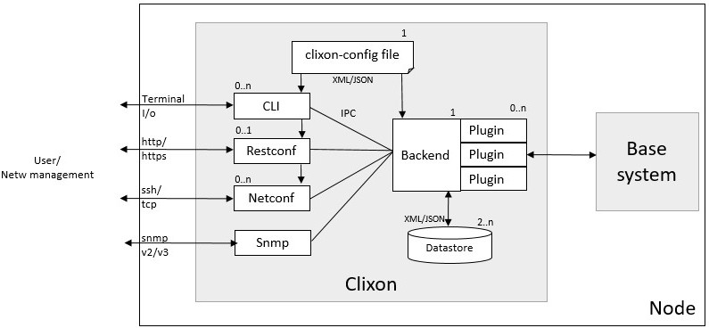
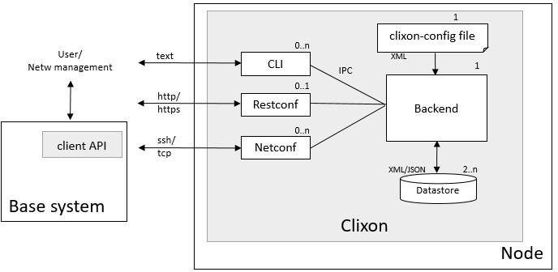

.. _clixon_overview:
.. sectnum::
   :start: 1
   :depth: 3
   
********
Overview
********

Clixon is a configuration management framework used by networking
devices and other computer systems.  Clixon provides a datastore, CLI,
NETCONF and RESTCONF interfaces all defined by YANG.

Clixon links:

  - `Source code at github <http://www.github.com/clicon/clixon>`_.
  - `Project <http://www.clicon.org>`_.
  - `Docs <https://clixon-docs.readthedocs.io/en/latest/>`_.

Most of the projects using Clixon are for networking devices. But Clixon
can be used for other YANG-based systems as well due to a modular and
pluggable architecture.

Clixon has a transaction mechanism that ensures configuration
operations are atomic. It also features a generated interactive
command-line interface using `CLIgen <http://www.cligen.se>`_.

The goal of Clixon is to provide a useful, production-grade, scalable
and free YANG based configuration tool.

Clixon is open-source and dual licensed. Either Apache License, Version 2.0 or GNU
General Public License Version 2.

System Architecture
===================
Clixon provides YANG functionality with Netconf, Restconf and CLI that
can be integrated with an existing "base system" in several ways. The integrations are:

  * A `plugin` integration where clixon handles all user interaction with the base system using backend plugins. This is the _primary_ Clixon usage model.
  * A `client` integration where the base system uses clixon for configurations as a "side-car". There is some ongoing work to make Clixon also work for this usage.

Plugin integration
------------------

		 
This describes how to integrate a base system with Clixon using plugins.

The Clixon architecture consists of a backend daemon with
configuration datastores and a set of internal clients: cli, restconf, netconf and snmp.

The clients provide frontend interfaces to users of the system, such
as a Network Management System (NMS) or an interactive human user. The
external interfaces include interactive CLI, RESTCONF over HTTP/HTTPS, and XML
NETCONF over TCP or SSH.  Internally, the clients and backend
communicate over an inter-process communication (IPC) bus via NETCONF
over a UNIX socket. It is possible to run over an INET socket as well, but some authentication
mechanisms are then disabled.

The backend manages configuration datastores and implements a
transaction mechanism for configuration operations (eg, create, read,
update, delete) . The datastore supports candidate, running and
startup configurations.

A system integrating Clixon using plugins, typically starts with a set
of YANG specifications. Backend plugins are written that interact with
the base system. The plugins are written in C using the Clixon API and
a set of plugin callbacks. The main callback is a transaction
callback, where you specify how configuration changes are made to your
system.

You can also design an interactive CLI using `CLIgen
<http://www.cligen.se>`_, where you specify the CLI commands and write
CLI plugins.  You will have to write CLI rules, but Clixon can
generate the configuration part of the CLI, including set, delete, show
commands for a specific syntax.
   
Notifications (streams) are supported both for CLI, NETCONF and RESTCONF clients.

Client integration
------------------

In a client architecture, the base system keeps existing APIs and
only YANG-based configurations are exposed via Clixon. The base system
acts as a clixon client and uses the clixon client module to subscribe
to configuration events using Netconf message passing.

In comparison, the tighter plugin architecture uses dynamically loaded plugins, callbacks and a shared datastore. See :ref:`clixon client api<client_api>` for more details.
	    
Platforms
=========
Clixon supports GNU/Linux, FreeBSD and Docker. MacOS may work. Linux
platforms include Ubuntu, Alpine, Openwrt and Raspian. CPU architectures
include x86_64, i686, and ARM.

Standards
=========
Clixon supports standards including YANG, NETCONF, RESTCONF, XML and XPath. See :ref:`Standards section<clixon_standards>` for more details.

How to get Clixon
=================
Get the Clixon source code from `Github <http://github.com/clicon/clixon>`_::

   git clone https://github.com/clicon/clixon.git

Support
========
Clixon interaction is best done posting issues, pull requests, or joining the Matrix clixon forum https://matrix.to/#/#clixonforum:matrix.org.

Bug reports
===========
Report bugs via `Github issues <https://github.com/clicon/clixon/issues>`_

Reference docs
==============
The user-manual is this document.
For reference documentation of the C-code, Doxygen is used. To build the reference documentation you need to check out the source code, and type ``make doc``, eg::

  git clone git@github.com:clicon/clixon.git
  cd clixon
  ./configure
  make doc

direct your browser to::

  file:///<your home path>/clixon/doc/html/index.html
  

