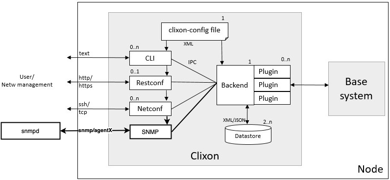

.. _snmp:
.. sectnum::
   :start: 19
   :depth: 3

**********
SNMP
**********

As a complement to HTTP/HTTPS/SSH Clixon supports SNMP for retreiving
and setting values. SNMP support was introduced in Clixon version
XX.YY and supports registration of OIDs through YANG specifications.

Architecture
============

See the :ref:`overview page <clixon_overview>` for a description of
the overall Clixon architecture.

The SNMP application plugs in to Clixon in the same way as the other
ones, the exception here is that it also will communicate with the
Net-SNMP daemon snmpd through either a Unix socket or TCP socket and
the user can then communicate with snmpd using any of the existing
SNMP capable tools that are available.

Configuration
=============

Net-SNMP
--------
To set up the communication between Clixon SNMP and Net-SNMP snmpd we
must instruct snmpd to use a Unix socket or TCP socket for the
communication. Net-SNMP uses the AgentX protocol (described in
RFC-2741) for the communication and a minimal snmpd.conf which is
known to be working can be seen below:

::

   master       agentx
   agentaddress 127.0.0.1,[::1]
   rwcommunity  public localhost
   agentXSocket unix:/var/run/snmp.sock
   agentxperms  777 777

We should also instruct Net-SNMP to use the MIBs we are interested
in. To load _all_ MIBs we can modify the file ``/etc/snmp/snmp.conf``
and comment the line starting with "mibs :", a minimal "snmp.conf" and
also make sure that "mibdirs" includes any directory where we might
store MIBs to be used:

::

   #mibs :
   mibdirs /usr/share/snmp/mibs:/usr/share/snmp/mibs/iana:/usr/share/snmp/mibs/ietf

We also want to tell snmpd to not load any of the modules we are implementing
using Clixon. For example, if we are using Clixon to implement IF-MIB and the
system MIB we want to tell snmpd to not load them and let us take care of that.

This can be done using the "-I" flag and prepend a "-" before each of the objects:

::
   
   -I -ifTable -I -system_mib -I -sysORTable

Note: Clixon will not take care of starting snmpd, the system must at
all times make sure that snmpd is running and can communicate with
Clixon SNMP and the user.

Clixon
------

The enable SNMP support in Clixon and build the "clixon_snmp"
application (the source code resides in "apps/snmp/") we must
enable SNMP support then running configure. Two new flags have
been added:

* --enable-netsnmp Enable SNMP support.
* --with-mib-generated-yang-dir Directory of generated YANG specs (default: $prefix/share/mibyang)

Then typing "make" the "clixon_snmp" executable will be build and
"make install" will install it as usual.

clixon_snmp command line options
--------------------------------
::

   $ clixon_snmp -h
   usage:clixon_snmp
   where options are
	-h		Help
	-D <level>	Debug level
	-f <file>	Configuration file (mandatory)
	-l (e|o|s|f<file>) Log on std(e)rr, std(o)ut, (s)yslog(default), (f)ile
	-o "<option>=<value>"	Give configuration option overriding config file (see clixon-config.yang)

clixon_snmp configuration
-------------------------
Clixon configuration have also been extended with two new attributes:

* ``<CLICON_SNMP_AGENT_SOCK>...</CLICON_SNMP_AGENT_SOCK>`` which will let Clixon know how to communicate directly to "snmpd" over AgentX.
* ``<CLICON_SNMP_MIB>NET-SNMP-EXAMPLES-MIB</CLICON_SNMP_MIB>`` tell which MIBs to use.

Example:

::

   <CLICON_SNMP_AGENT_SOCK>unix:/var/run/snmp.sock</CLICON_SNMP_AGENT_SOCK>
   <CLICON_SNMP_MIB>NET-SNMP-EXAMPLES-MIB</CLICON_SNMP_MIB>

Note that the socket ``/var/run/snmp.sock`` is the same as we configured
in "snmpd.conf" above.

MIB registration
================

Clixon will register MIBs using YANG specifications. To achive this
the MIB must first be converted to YANG format using for example the
tool smidump.

In Debian smidump is available in the package "smitools".

To convert a MIB to YANG format we can invoke smidump with the "-f
yang" flag and point it to a MIB. MIBs will usually live under the
directory "/usr/share/snmp/mibs/":

::

   $ smidump -f yang /usr/share/snmp/mibs/NET-SNMP-EXAMPLES-MIB.txt > NET-SNMP-EXAMPLES.yang

Once we have converted the MIB we are interested in using together
with Clixon we should tell Clixon where to find it using the normal
``<CLICON_YANG_DIR>...</CLICON_YANG_DIR>`` attribute in the
configuation.
