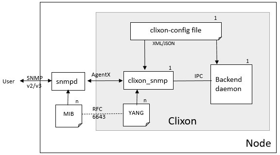

.. _snmp:
.. sectnum::
   :start: 12
   :depth: 3

**********
SNMP
**********

Clixon supports SNMP for retreiving / setting values and sending SNMPv2c traps via netsnmp
using a MIB-YANG mapping defined in RFC6643.

Architecture
============

The SNMP frontend acts as an intermediate daemon between the Net-SNMP
daemon (snmpd) and the Clixon backend. Clixon-snmp communicates over the AgentX
protocol to snmpd typically via a UNIX socket, and over the internal IPC protocol to the Clixon
backend.

Clixon-snmp implements RFC 6643 `Translation of Structure of
Management Information Version 2 (SMIv2) MIB Modules to YANG
Modules`. The RFC defines how a MIB is translated to YANG using
extensions that define a mapping between YANG statements and SMI object IDs and types in the MIB.

In principle, it is also possible to construct a MIB from YANG using
the same method, although this is more limited and may involve manual work.

A user can then communicate with snmpd using any of the SNMP
v2/v3 tools, such as `snmpget`, `snmpwalk` and others.

.. note::
   * SNMP support is introduced in Clixon version 5.8
   * SNMPv2 traps support is introduced in Clixon version 7.2.0

Configuration
=============

Net-SNMP
--------
.. note::
   Use Net-SNMP version 5.9 or later

To set up AgentX communication between ``clixon_snmp`` and ``snmpd`` a
Unix or TCP socket is configured. This socket is also configured in
Clixon (see below). An example `/etc/snmp/snmpd.conf` is as follows::

   master       agentx
   agentaddress 127.0.0.1,[::1]
   rwcommunity  public localhost
   agentXSocket unix:/var/run/snmp.sock
   agentxperms  777 777

It is necessary to ensure snmpd does `not` to load modules
implemented by Clixon. For example, if Clixon implements the IF-MIB and
system MIBs, snmpd should not load those modules. This can be done
using the "-I" flag and prepending a "-" before each module::

   -I -ifTable -I -system_mib -I -sysORTable

Further, Clixon itself does not start netsnmp itself, you need to ensure that
netsnmp is running when clixon_snmp is started. Likewise, if snmpd
is restarted, clixon_snmp must also be restarted.

.. note::
     Net-snmp must be started via systemd or some other external mechanism before clixon_snmp is started.

Clixon
------
To build the snmp support, netsnmp is enabled at configure time.  Two configure  options are added for SNMP:

* ``--enable-netsnmp`` Enable SNMP support.
* ``--with-mib-generated-yang-dir`` For tests: Directory of generated YANG specs (default: $prefix/share/mibyang)

Then type "make" to build the "clixon_snmp" executable and "make install" to install.

clixon_snmp command line options
--------------------------------
::

   $ clixon_snmp -h
   usage:clixon_snmp
   where options are
	-h		Help
        -V              Show version and exit
	-D <level>	Debug level
	-f <file>	Configuration file (mandatory)
	-l (e|o|s|f<file>) Log on std(e)rr, std(o)ut, (s)yslog(default), (f)ile
        -C <format>     Dump configuration options on stdout after loading and exit. Format is one of xml|json|text
        -z              Kill other clixon_snmp daemon and exit
	-o "<option>=<value>"	Give configuration option overriding config file (see clixon-config.yang)

clixon_snmp configuration
-------------------------
There are two SNMP related options in the Clixon configuration:

CLICON_SNMP_AGENT_SOCK
   String description of the AgentX socket that clixon_snmp listens to.

CLICON_SNMP_MIB
   Names of MIBs that are used by clixon_snmp.

Example::

   <CLICON_SNMP_AGENT_SOCK>unix:/var/run/snmp.sock</CLICON_SNMP_AGENT_SOCK>
   <CLICON_SNMP_MIB>IF-MIB</CLICON_SNMP_MIB>

Note that the socket ``/var/run/snmp.sock`` is the same as configured
in "snmpd.conf" above.

MIB mapping
===========
Clixon registers MIBs with netsnmp by using YANG specifications. To achieve this,
the MIB is first converted (according to RFC6643) to YANG format.

Generating YANG
---------------
MIB to YANG conversion can be done using the ``smidump`` tool, version 0.5 or later. Manual
mapping is also possible.  In Debian smidump is available in the
package "smitools". You may also find existing repos with converted MIBs.

To convert a MIB to YANG, invoke ``smidump`` with the "-f yang" flag
and point it to a MIB. MIBs will usually be in the directory
"/usr/share/snmp/mibs/"::

   $ smidump -f yang /usr/share/snmp/mibs/IF-MIB.txt > IF-MIB.yang

.. note::
   smidump 0.5 or later must be used

Once a MIB is converted to YANG, two things should be done:

1) The YANG is registered as an SNMP module using the ``CLICON_SNMP_MIB`` configuration option
2) The YANG file must be placed so that it can be found using the regular Clixon YANG finding mechanism, as described in :ref:`Finding YANG files <clixon_configuration>`

Config vs state
---------------
By default, all RFC6643 mappings are ``config false``, ie, no configuration data.

To change to configuration data, a deviation statement is made as the following example illustrates::

    deviation "/clixon-types:CLIXON-TYPES-MIB" {
     deviate replace {
        config true;
     }
  }

For more info, see Section 11 in RFC 6643.

Types
-----
Scalar types are mapped between SMI and YANG types using RFC6643. All
types as used by IF-MIB, System and Entity MIBs are supported.

Tables
------
SNMP tables are supported for config and state and are mapped to YANG
lists. It is possible to get and set individual values either via the
SNMP API, or via any of the other CLIXON frontends.

Table indexes can be integers and non-integers.  Multiple table indexes are supported.

As an implementation detail, Clixon uses the `table` abstraction in
the netsnmp agent library, not `table-data` or `table-instance`.

RowStatus
---------
Clixon supports SMIv2 RowStatus for table handling. Where RowStatus is
used, the status of the row is returned and set to either `active`,
`notInService` or `notReady`.

When writing the status of the row can be set to either `createAndGo`,
`createAndWait`, `active` or `destroy`.

The `rowstatus` firled itself and all row values in `createAndWait`
mode uses an internal cache which is held in memory by the clixon snmp
agent. This internal cache is flushed to Clixon when setting a row to
`active`, like a "pre-commit phase". When `clixon_snmp` is restarted,
the cache is cleared.

SNMPv2 traps
------------
All stream notifications are converted to SNMPv2 traps and forwarded to the Net-SNMP daemon. The precondition is that an OID mapping is also defined for the notifications. If the notification has status data, it is bound to the corresponding OID and sent with the trap.

.. note::
   * clixon_snmp subscribes to all streams which are read from the backend.
   * The Net-SNMP daemon must be configured for sending traps. (Check trap2sink configuration in snmpd.conf config file.)